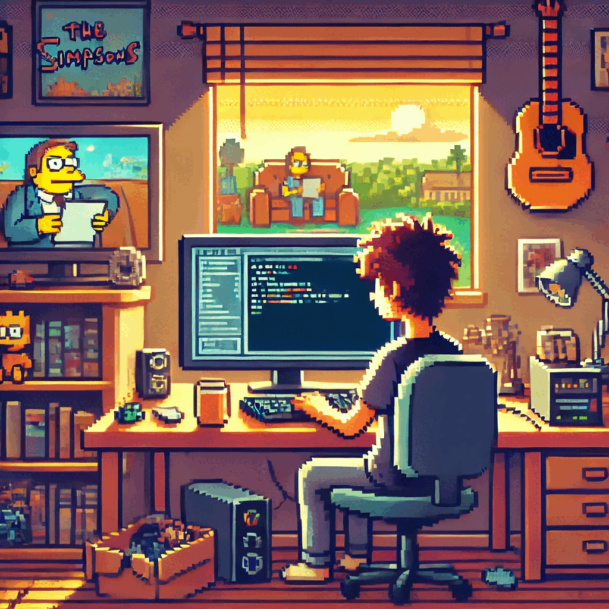
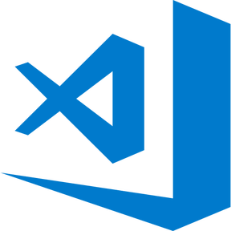

  

  

<h2 align="center">Hi there 👋, I'm  Max !</h2>

<h2> About Me :</h2>

👨‍💻 Starting from August this year, I've immersed myself in front-end development, acquiring valuable experience in crafting web applications and services. Whether working solo or in tandem with my training team, I've demonstrated a knack for swiftly coding new functionalities and tackling bug fixes.

<h2>Roadmap 2024 :</h2>

✍️ - Improve: HTML | CSS 

📚 - Learn: JavaScript | React | TypeScript | Node.js | Next.js | React Native 

<h3 align="center" style="padding: 20px 0; font-size: 20px; font-weight: 700; letter-spacing: 0.1em; color: #7928ca;">Languages and Tools:</h3>

    <!-- 
     -->
    
    
    
    <!-- 
    
     -->

